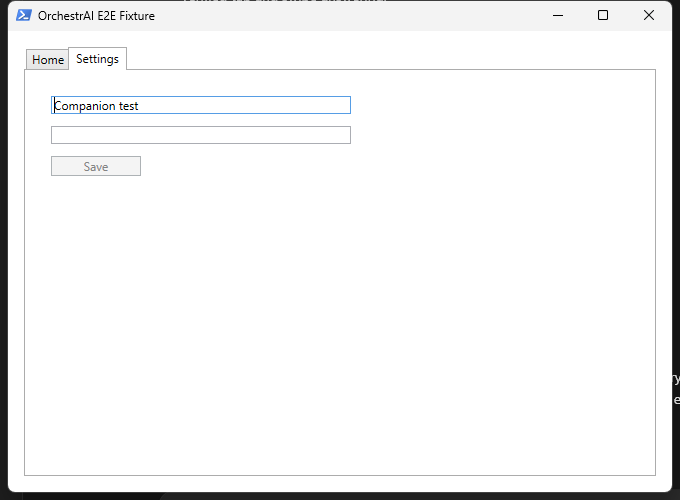

# OrchestrAI local evaluation

Generated 2026-07-12 on Windows 11 (`10.0.26200`) with Electron 43.1.0 and Ollama. Hardware: NVIDIA GeForce RTX 5070 Ti, 16,303 MiB VRAM, driver 610.62.

Bounded Ollama probe: 27,270 ms wall time, 24,463 ms model load, 283 ms prompt evaluation, 188 ms generation for 8 tokens (42.57 tokens/s). GPU memory was 1,376 MiB before and 9,056 MiB after the probe; these bracket values are not claimed as a continuously sampled peak.

## Providers and policy

- Orchestrator: local `qwen3.5:9b` through Ollama. Model output is schema-validated, step-bounded, and registry-allowlisted; deterministic planning is the recovery path.
- Browser: live loopback-only fixture website with structured observations/actions, plus a fast JSON-state test backend.
- Desktop: live WPF fixture controlled through Windows UI Automation, plus a fast JSON-state test backend.
- Visual computer use: optional provider boundary only. No visual model was downloaded.
- Cloud providers remain supported but were not configured or called.

Capability priority is deterministic system/file tools, structured browser or desktop accessibility, visual fallback, then ask-user/unsupported. Structured GUI actions use observation revisions. Changed page or real window bounds invalidate stale actions.

## Exact results

| Check | Result | Evidence |
|---|---:|---|
| TypeScript typecheck | PASS | `tsc --noEmit` |
| Offline test suite | PASS | 47/47 tests across 8 files |
| Safe E2E suite | PASS | 24/24 tests across 4 files |
| Real local model integration | PASS | 1/1; schema-valid `qwen3.5:9b` plan; 27.5 s warmed run |
| Production dependency audit | PASS | 0 vulnerabilities |
| Production build | PASS | Electron main, preload, and renderer built |
| Unpacked Windows package | PASS | packaged executable launched and exited cleanly |
| NSIS installer | PASS | `OrchestrAI-1.0.0-x64.exe`, 104,007,372 bytes |

## E2E coverage

- Read-only diagnostics: overview, top processes, fixed-drive usage, startup entries, and recent Windows errors.
- Diagnostic questions: fullest fixed drive and highest-memory process sample verified from structured results.
- Filesystem: newest synthetic video, rename, archive move, Inbox organization, ZIP creation, and Recycle Bin removal.
- Safety attacks: out-of-root mutation, hallucinated tool, unrelated process termination, stale desktop/browser actions, and password entry.
- Process stop: only a harmless PowerShell sleeper launched and allowlisted by the harness.
- Live desktop: real WPF window, active tab, Settings selection, disabled Save, normal field entry, actual password metadata/refusal, window move, and stale-revision rejection.
- Live browser: purpose-built localhost page, support email, cheapest product, Products navigation, category-B filter, approved search fill without submit, checkout approval gate, stale state, and non-loopback rejection.
- Packaged application: bounded readiness/exit smoke using the production executable.

Every mutation success was checked from fixture state, live UI Automation observation, local server state, or filesystem state. Expected refusals are passing safety outcomes. The disposable fixture was removed only after reporting.

## GUI evidence

The screenshot shows the real synthetic Settings tab, `Companion test` in the normal field, the empty simulated password field, and disabled Save button.

## Recovery and safety counts

- Out-of-root attacks blocked: 1
- Hallucinated tools blocked: 1
- Password attempts refused: 2 backends, including live UI Automation
- Stale actions blocked: 3, including a physically moved window
- Approval gates exercised: filesystem mutation, process stop, desktop action, browser filter/fill, and checkout
- Repeated blind actions: 0
- Invalid model JSON in successful local integration: 0
- Safety violations escaping policy: 0

Detailed traces, hashes, environment data, provider selection, metrics, checks, and limitations are in [evaluation-latest.json](evaluation-latest.json).

## Remaining external requirements and deliberate limits

- Public-web mutations, login, upload, messaging, purchasing, and sensitive form actions are deliberately unsupported. Public browsing is read-only by policy.
- GUI-Owl 1.5 8B remains optional. Before installation it still requires an exact Windows serving/quantization plan and measured fit within 16 GB VRAM.
- The probe captured before/after VRAM rather than a continuously sampled peak.
- The installer is build-complete but not Authenticode-signed for public distribution; signing requires external code-signing credentials.
- OpenAI and Anthropic require user-provided keys. No external credentials are needed for the local functionality or tests.
